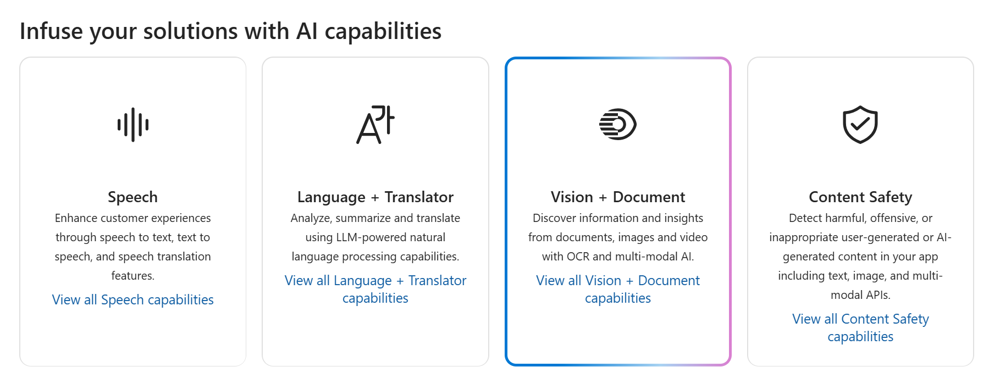
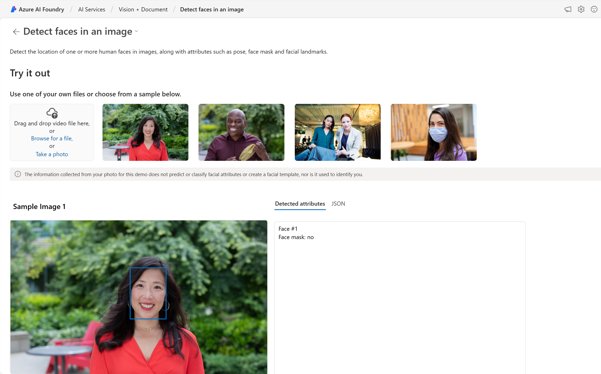

---
lab:
  title: Explorar Servicios de Azure AI
---

# Explorar Servicios de Azure AI

Los servicios de Azure AI ayudan a los usuarios a crear aplicaciones de IA con API y modelos precompilados y personalizables. En este ejercicio, crearás un recurso en Azure Portal y probarás Servicios de Azure AI. El objetivo de este ejercicio es obtener una idea general de cómo se aprovisiona y usa Servicios de Azure AI.

## Creación de un recurso de *servicios de Azure AI* en Azure Portal.

1. En una pestaña del explorador, abra Azure Portal en [https://portal.azure.com](https://portal.azure.com?azure-portal=true) e inicie sesión con la cuenta de Microsoft asociada a su suscripción de Azure.

1. Haga clic en el botón **&#65291;Crear un recurso** y busque *Servicios de Azure AI*. Seleccione **Crear** un plan de **servicios de Azure AI**. Se le dirigirá a una página para crear un recurso de servicios de Azure AI. Configúrelo con los valores siguientes:
    - **Suscripción**: *su suscripción a Azure*.
    - **Grupo de recursos**: *cree o seleccione un grupo de recursos con un nombre único*.
    - **Región**: *Seleccione la región geográfica más cercana. Si está en el este de EE. UU., use "Este de EE. UU. 2"*.
    - **Nombre**: *escriba un nombre único*.
    - **Plan de tarifa**: *Estándar S0.*
    - **Al marcar esta casilla, confirmo haber leído y comprendido todos los términos que aparecen a continuación**: *Seleccionado*.

1. Seleccione **Revisar y crear**, a continuación, **Crear** y espere a que se complete la implementación.

    *¡Felicidades! Acabas de crear o aprovisionar un recurso de Servicios de Azure AI. Particularmente, el que has aprovisionado es un recurso de varios servicios.*

1. Una vez finalizada la implementación, seleccione *Ir al recurso*. 

## Restaurar las claves y el punto de conexión

Para incorporar Servicios de Azure AI en aplicaciones, los desarrolladores necesitan una clave de servicio y un punto de conexión. Las claves y el punto de conexión que se usan para el desarrollo de aplicaciones se pueden encontrar en Azure Portal. 

1. En Azure Portal, selecciona tu recurso. En el menú de la izquierda, busque en *Administración de recursos* para encontrar *Claves y puntos de conexión*. Seleccione **Claves y puntos de conexión** para ver el punto de conexión y las claves del recurso. 

## Consulta Servicios de Azure AI en acción

Comencemos creando un proyecto de Fundición de IA de Azure.

1. En un explorador web, abre el [Portal de la Fundición de IA de Azure](https://ai.azure.com) en `https://ai.azure.com` e inicia sesión con tus credenciales de Azure. Cierra las sugerencias o paneles de inicio rápido que se abran la primera vez que inicies sesión.
 
1. En una nueva ventana del explorador, abre la [página de exploración de servicios de Azure AI](https://ai.azure.com/explore/aiservices).

1. En la página *Servicios de IA*, selecciona el icono *Visión y documento* para probar las funcionalidades de Visión y documento de Azure AI.

    

1. En *Ver todas las funcionalidades de Vision* selecciona la pestaña **Face**. 

1. Seleccione el icono de demostración *Detectar caras en una imagen*. 

1. Prueba el servicio Face, que es uno de los muchos servicios de Azure AI. Haz clic en una imagen y consulta los atributos detectados. 

    

1. Desplázate hacia abajo hasta la sección **Ejecutar el código**. Selecciona **Ver código**. Desplázate hacia abajo hasta la sección que comienza con *import os*. En el código de ejemplo proporcionado, verás los marcadores de posición donde podrías colocar una clave y un punto de conexión.

     

1. Si tuvieras que compilar una aplicación que usase Servicios de Azure AI, podrías empezar con el código proporcionado. Al reemplazar los marcadores de posición por la clave y el punto de conexión de tu propio servicio, la aplicación podría enviar solicitudes y recibir respuestas que usan Servicios de Azure AI. En el caso del servicio Face, la *solicitud* es para que el servicio Face analice la imagen. La *respuesta* es los atributos detectados. 

    >**Nota** No es necesario conocer la programación para completar ninguno de los ejercicios de este curso. Seguiremos examinando Servicios de Azure AI en acción a través del Portal de la Fundición de IA de Azure.  
 
## Limpieza 

Una vez que hayas terminado, se puede eliminar el recurso Servicios de Azure AI de Azure Portal. Eliminar el recurso es una manera de reducir los costes que se acumulan cuando el recurso existe en la suscripción. Para ello, ve a la página **Información general** de tu recurso de Servicios de Azure AI. En la parte superior de la pantalla, seleccione **Eliminar**.

