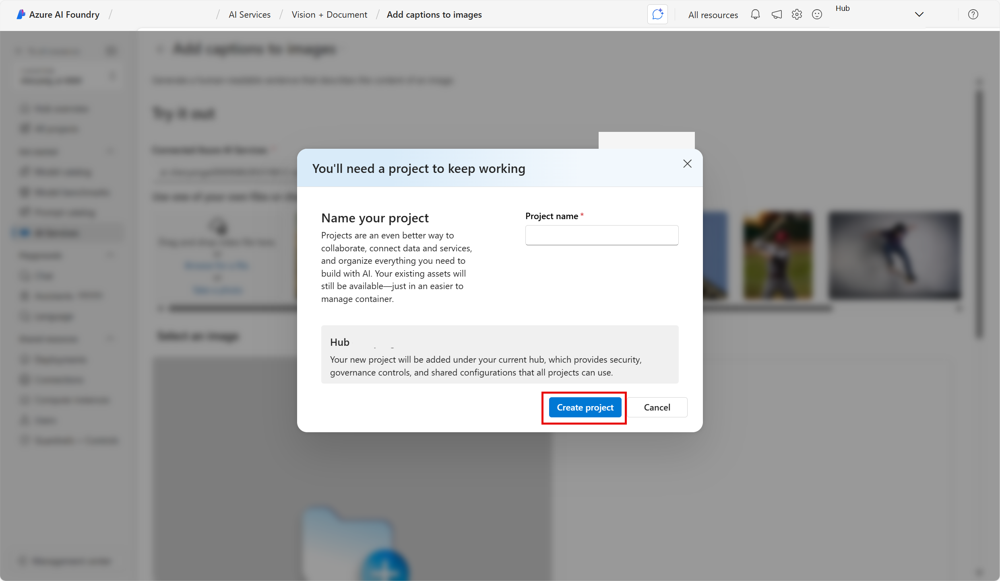

# Exploración de la seguridad del contenido en Fundición de IA de Azure

Los servicios de Azure AI ayudan a los usuarios a crear aplicaciones de IA con API y modelos precompilados y personalizables. En este ejercicio, echarás un vistazo a uno de los servicios, Seguridad del contenido de Azure AI, que te permite moderar el contenido de texto e imagen. En el Portal de la Fundición de IA de Azure, la plataforma de Microsoft para crear aplicaciones inteligentes, usarás la Seguridad del contenido de Azure AI para clasificar el texto y asignarle una puntuación de gravedad. 

> **Nota** El objetivo de este ejercicio es obtener una idea general de cómo se aprovisionan y usan los servicios de Azure AI. Content Safety se usará como ejemplo, pero no se espera que obtenga un conocimiento completo de la seguridad del contenido en este ejercicio.

## Creación de un proyecto en el portal de Azure AI Foundry

1. En una pestaña del explorador, ve a [Portal de la Fundición de IA de Azure](https://ai.azure.com?azure-portal=true).

2. Inicie sesión con su cuenta. 

3. En la página principal del Portal de la Fundición de IA de Azure, selecciona **Crear un proyecto**. En Fundición de IA de Azure, los proyectos son contenedores que te ayudan a organizar el trabajo.  

    

4. En el panel *Crear un proyecto*, verás un nombre de proyecto generado, que puedes mantener tal cual. Dependiendo de si has creado un centro en el pasado, verás una lista de *nuevos* recursos de Azure que se van a crear o una lista desplegable de centros existentes. Si ves la lista desplegable de centros existentes, selecciona *Crear nuevo centro*, crea un nombre único para el centro y selecciona *Siguiente*.  
 
    

> **Importante**: Necesitarás un recurso de Servicios de Azure AI aprovisionado en una ubicación específica para completar el resto del laboratorio.

5. En el mismo panel *Crear un proyecto*, selecciona **Personalizar** y elige una de las siguientes **Ubicaciones**: Este de EE. UU., Centro de Francia, Centro de Corea del Sur, Oeste de Europa u Oeste de EE. UU. para completar el resto del laboratorio. Después selecciona **Crear**. 

1. Toma nota de los recursos que se crean: 
- Servicios de Azure AI
- Centro de Azure AI
- Proyecto de Azure AI
- Cuenta de almacenamiento
- Key vault
- Resource group  

6. Una vez creados los recursos, se mostrará la página *Información general* de tu proyecto. 

7. Para usar la Seguridad del contenido, debes realizar una actualización de permisos al recurso del *centro de Azure AI*. Para ello, abre [Azure Portal](https://portal.azure.com?portal-azure=true) e inicia sesión con la misma suscripción que usaste para crear los recursos de Fundición de IA.  

8. En Azure Portal, usa la barra de búsqueda de la parte superior de la página para buscar y seleccionar **Fundición de IA de Azure**. En la página de recursos, selecciona el recurso que acabas de crear, que es *tipo***centro de Azure AI**.  

9. En Azure Portal, en el panel de la izquierda, selecciona **Access Control (IAM)**. A continuación, en el panel abierto, seleccione **Agregar** junto al signo más y seleccione **Agregar asignación de roles**. 

10. Busca **Evaluador de seguridad de Azure AI** en la lista de roles y selecciónalo. Seleccione **Siguiente**. 

11. Use la siguiente configuración para asignar el rol a su propio usuario: 
    - **Asignar acceso a**: seleccione el *usuario, el grupo o la entidad de servicio*.
    - **Miembros**: haga clic en *Seleccionar miembros*.
        - En el panel *Seleccionar miembros* abierto, busque su nombre. Haga clic en el ícono más que hay al lado de su nombre. Después, haga clic en **Seleccionar**.
    - **Descripción**: *déjela en blanco*

12. Seleccione **Revisar y asignar** y, a continuación, seleccione **Revisar y asignar** de nuevo para agregar la asignación de roles.    

13. En el explorador, vuelva a [Portal de la Fundición de IA de Azure](https://ai.azure.com?azure-portal=true). Seleccione su proyecto. 

14. En el menú izquierdo de la pantalla, selecciona **Servicios de IA**.
 
      

15. En la página *Servicios de IA*, selecciona el icono *Visión y documento* para probar las funcionalidades de Visión y documento de Azure AI.
    
    

## Prueba de la moderación de texto con Seguridad del contenido en el Portal de la Fundición de IA de Azure. 

1. En la página *Seguridad del contenido* en *Filtrar contenido de texto*, selecciona **Moderar contenido de texto**.

2. En la página *Moderar contenido de texto*, en el encabezado *Probarlo*, selecciona el recurso de Servicios de Azure AI que acabas de crear en el menú desplegable.   

3. En *Ejecutar una prueba sencilla*, selecciona el icono **Contenido seguro**. Observe que el texto guardado se muestra en la lista a continuación. 

4. Haga clic en **Ejecutar prueba**. La ejecución de una prueba llama al modelo de aprendizaje profundo de Content Safety Service. El modelo de aprendizaje profundo ya se ha entrenado para reconocer contenido no seguro.

5. En el panel *Resultados*, inspeccione los resultados. Hay cuatro niveles de gravedad que van de "segura" a "alta" y cuatro tipos de contenido dañino. ¿El servicio de inteligencia artificial de Seguridad del contenido considera que este ejemplo es aceptable o no? Lo que es importante tener en cuenta es que los resultados están dentro de un intervalo de confianza. Un modelo bien entrenado, como uno de los modelos estándar de Azure AI, puede devolver resultados que tengan una alta probabilidad de coincidir con los resultados de etiquetas aplicadas por humanos. Cada vez que ejecute una prueba, vuelva a llamar al modelo. 

6. Ahora pruebe otro ejemplo. Seleccione el texto de Contenido violento con errores ortográficos. Compruebe que el contenido aparece en el cuadro siguiente.

7. Haga clic en **Ejecutar prueba** y vuelva a inspeccionar los resultados en el panel de resultados. 

Puede ejecutar pruebas en todos los ejemplos proporcionados y, a continuación, inspeccionar los resultados.

## Limpieza

Si no tiene previsto realizar más ejercicios, elimine los recursos que ya no necesite. Esto evita la acumulación de costes innecesarios.

1. Abra [Azure Portal]( https://portal.azure.com) y seleccione el grupo de recursos que contenga el recurso que creó.
1. Seleccione el recurso y seleccione **Eliminar** y, después, **Sí** para confirmar. A continuación, se eliminará el recurso.

## Saber más

En este ejercicio solo se muestran algunas de las funcionalidades del servicio Seguridad del contenido. Para obtener más información sobre lo que puedes hacer con este servicio, consulta la [página de Seguridad del contenido](https://learn.microsoft.com/azure/ai-services/content-safety/overview).
