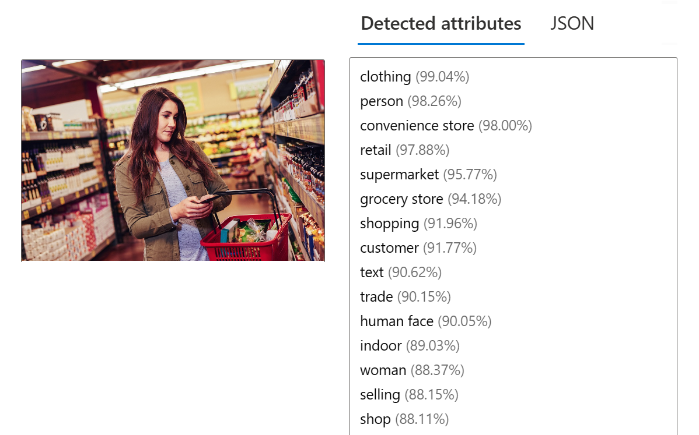

---
lab:
  title: Análisis de imágenes en Studio de Visión
---

# Análisis de imágenes en Studio de Visión 

**Visión de Azure AI** incluye numerosas funcionalidades para comprender el contexto y el contenido de imágenes y extraer información de las mismas. Studio de Visión de Azure AI permite probar muchas de las funcionalidades del análisis de imágenes. 

En este ejercicio, usará Studio de Visión para analizar imágenes mediante experiencias integradas de prueba. Supongamos que el minorista ficticio *Northwind Traders* decidió implementar una "tienda inteligente" en la que hay servicios de inteligencia artificial que supervisan la tienda para identificar a aquellos clientes que requieran asistencia y orientan a los empleados para ayudales. Gracias a Visión de Azure AI, las imágenes de las cámaras de la tienda se pueden analizar para proporcionar descripciones acertadas sobre lo que aparezca en ellas.

## Creación de un grupo de recursos de *servicios de Azure AI*

Es posible usar las funcionalidades de análisis de imágenes de Visión de Azure AI con un recurso de varios servicios de **servicios de Azure AI**. Si aún no lo ha hecho, cree un recurso de **servicios de Azure AI** en la suscripción de Azure.

1. En otra pestaña del explorador, abra Azure Portal en [https://portal.azure.com](https://portal.azure.com?azure-portal=true) e inicie sesión con la cuenta de Microsoft asociada a la suscripción de Azure.

1. Haga clic en el botón **&#65291;Crear un recurso** y busque *Servicios de Azure AI*. Seleccione **Crear** un plan de **servicios de Azure AI**. Se le dirigirá a una página para crear un recurso de servicios de Azure AI. Configúrelo con los valores siguientes:
    - **Suscripción**: *su suscripción a Azure*.
    - **Grupo de recursos**: *cree o seleccione un grupo de recursos con un nombre único*.
    - **Región**: Este de EE. UU.
    - **Nombre**: *escriba un nombre único*.
    - **Plan de tarifa**: *Estándar S0.*
    - **Al marcar esta casilla, confirmo haber leído y comprendido todos los términos que aparecen a continuación**: *Seleccionado*.

1. Seleccione **Revisar y crear**, a continuación, **Crear** y espere a que se complete la implementación.

## Conecte el recurso del servicio Azure AI a Studio de Visión

A continuación, conecte el recurso del servicio Azure AI que aprovisionó anteriormente a Studio de Visión.

1. En otra pestaña del explorador, vaya a [Studio de Visión](https://portal.vision.cognitive.azure.com?azure-portal=true).

1. Inicie sesión con su cuenta y asegúrese de usar el mismo directorio que el mismo donde creó el recurso de servicios de Azure AI.

1. En la página principal de Vision Studio, seleccione **Ver todos los recursos** en el encabezado **Introducción a Visión**.

    

1. En la página **Seleccione un recurso con el que trabajar**, mantenga el cursor del mouse sobre el recurso que creó anteriormente en la lista y active la casilla situada a la izquierda del nombre del recurso. A continuación, seleccione **Seleccionar como recurso predeterminado**.

    > **Nota:**: Si el recurso no apareciera en la lista, es posible que tenga que **Actualizar** la página.

    

1. Cierre la página de configuración seleccionando la "x" en la parte superior derecha de la pantalla.

## Generación de títulos de imágenes

Ahora ya está listo para usar Studio de Visión para analizar imágenes tomadas por una cámara en el almacén de *Northwind Traders*.

Echemos un vistazo a la funcionalidad de títulos de imágenes de Visión de Azure AI. Los títulos de imágenes están disponibles a través de las características **Título** y **Títulos densos**.

1. En un explorador web, vaya a [Studio de Visión](https://portal.vision.cognitive.azure.com?azure-portal=true).

1. En la página de aterrizaje **Introducción a Visión**, seleccione la pestaña **Análisis de imágenes** y, a continuación, seleccione el icono **Agregar títulos a imágenes**.

    

1. En el subtítulo **Probar**, confirme la política de uso de recursos leyendo y activando la casilla.  

1. Seleccione [**https://aka.ms/mslearn-images-for-analysis**](https://aka.ms/mslearn-images-for-analysis) para descargar **image-analysis.zip**. Abra la carpeta en el equipo y busque el archivo denominado **store-camera-1.jpg**, que contiene la siguiente imagen:

    

1. Cargue la imagen **store-camera-1.jpg** arrastrándola al cuadro **Arrastrar y colocar archivos aquí** o navegando hasta el en el sistema de archivos.

1. Observe la descripción generada, visible en el panel **Atributos detectados** de la derecha de la imagen.

    La funcionalidad **Título** proporciona una sola frase en inglés legible que describe el contenido de la imagen.

1. A continuación, use la misma imagen para poner **Títulos densos**. Vuelva a la página principal de **Studio de Visión** y, como hizo antes, seleccione la pestaña **Análisis de imágenes**. A continuación, seleccione el icono **Títulos densos**.

    La característica **Títulos densos** difiere de la funcionalidad **Títulos**, en la que se proporcionan varios títulos legibles para una imagen: uno que describe el contenido de la imagen y otros, en los que cada uno cubre los objetos esenciales detectados en la imagen. Cada objeto detectado incluye un cuadro de límite, que define las coordenadas de píxel dentro de la imagen asociada al objeto.

1. Mantenga el puntero sobre uno de los títulos de la lista de atributos **Detectados** y observe lo que sucede dentro de la imagen.

    

    Mueva el cursor del mouse sobre los otros títulos de la lista y observe cómo cambia el rectángulo de selección de la imagen para resaltar la parte de la imagen usada para generar el título.

## Etiquetado de imágenes

La siguiente característica que probará es la funcionalidad **Extraer etiquetas**. La extracción de etiquetas se basa en miles de objetos reconocibles, incluyendo seres vivos, paisajes y acciones.

1. Vuelva a la página principal de Studio de Visión y, a continuación, seleccione el icono **Extraer etiquetas comunes de imágenes** en la pestaña **Análisis de imágenes**.

2. En **Elija el modelo que desee probar**, deje seleccionado **Producto precompilado frente a modelo de rango**. En **Elija el idioma**, seleccione **Inglés** o un idioma de su preferencia.

3. Abra la carpeta que contenga las imágenes que descargó y busque el archivo denominado **store-image-2.jpg**, que tiene el siguiente aspecto:

    

4. Cargue el archivo **store-camera-2.jpg**.

5. Revise la lista de etiquetas extraídas de la imagen y la puntuación de confianza de cada una en el panel de atributos detectados. Aquí, la puntuación de confianza es la probabilidad de que el texto del atributo detectado describa lo que realmente está en la imagen. Observe en la lista de etiquetas que incluya no solo objetos, sino acciones, como *comprando*, *vendiendo* y *de pie*.

    

## Detección de objetos

En esta tarea, se usa la característica **Detección de objetos** de Análisis de imágenes. Detección de objetos detecta y extrae cuadros de límite basados en miles de objetos reconocibles y seres vivos.

1. Vuelva a la página principal de Studio de Visión y, a continuación, seleccione el icono **Detectar objetos comunes en imágenes** en la pestaña **Análisis de imágenes**.

1. En **Elija el modelo que desee probar**, deje seleccionado **Producto precompilado frente a modelo de rango**.

1. Abra la carpeta que contenga las imágenes que descargó y busque el archivo denominado **store-camera-3.jpg**, que tiene el siguiente aspecto:

    

1. Cargue el archivo **store-camera-3.jpg**.

1. En el cuadro **Atributos detectados**, observe la lista de objetos detectados y sus puntuaciones de confianza.

1. Mantenga el cursor del mouse sobre los objetos de la lista **Atributos detectados** para resaltar el cuadro de límite del objeto en la imagen.

1. Mueva el control deslizante **Valor de umbral** hasta que se muestre un valor de 70 a la derecha del control deslizante. Observe lo que sucede con los objetos de la lista. El control deslizante del umbral especifica que solo se deberían mostrar los objetos identificados con una puntuación de confianza o una probabilidad superior al umbral.

## Limpiar

Si no tiene previsto realizar más ejercicios, elimine los recursos que ya no necesite. Esto evita la acumulación de costes innecesarios.

1.  Abra [Azure Portal]( https://portal.azure.com) y seleccione el grupo de recursos que contenga el recurso que creó. 
1.  Seleccione el recurso y seleccione **Eliminar** y, después, **Sí** para confirmar. A continuación, se eliminará el recurso.

## Saber más

Para obtener más información sobre lo que es posible hacer con este servicio, consulte la [página Visión de Azure AI](https://learn.microsoft.com/azure/ai-services/computer-vision/overview).
