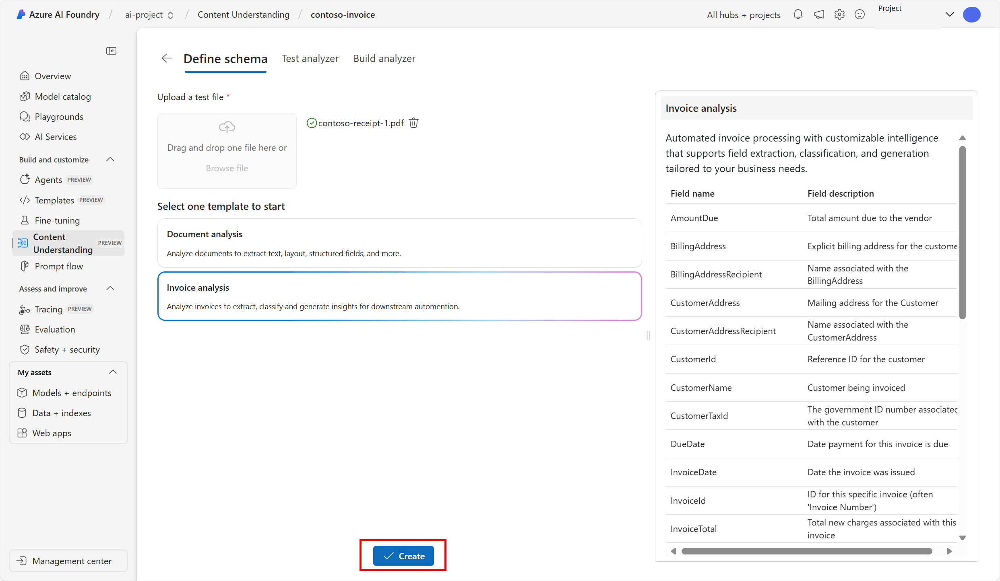
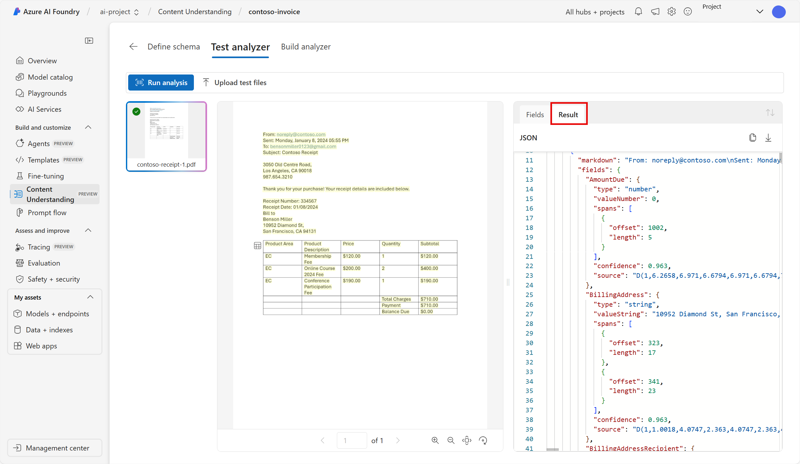

---
lab:
  title: Extracción de datos con comprensión de contenidos en el Portal de la Fundición de IA de Azure
---

# Extracción de datos con comprensión de contenidos en el Portal de la Fundición de IA de Azure

**Servicio de comprensión de contenido de IA de Azure (versión preliminar)** usa la IA generativa para procesar contenido de cualquier tipo (documentos, imágenes, vídeos y audio) en un formato de salida definido por el usuario.

En este ejercicio, usarás el Servicio de comprensión de contenido de IA de Azure en el Portal de la Fundición de IA de Azure, la plataforma de Microsoft para crear aplicaciones inteligentes, para reconocer los datos de las facturas. 

Este ejercicio dura aproximadamente **25** minutos.

## Creación de un proyecto de Fundición de IA de Azure

Comencemos creando un proyecto de Fundición de IA de Azure.

1. En un explorador web, abre el [Portal de la Fundición de IA de Azure](https://ai.azure.com) en `https://ai.azure.com` e inicia sesión con tus credenciales de Azure. Cierra las sugerencias o paneles de inicio rápido que se abran la primera vez que inicias sesión y, si es necesario, usa el logotipo de **Fundición de IA de Azure** en la parte superior izquierda para navegar a la página principal, que es similar a la siguiente imagen (cierra el panel **Ayuda** si está abierto):

    

1. En la página principal, selecciona **+Crear proyecto**.

1. En el asistente para **crear un proyecto**, escribe un nombre válido y si se te sugiere un centro existente, elige la opción para crear uno nuevo. A continuación, revisa los recursos de Azure que se crearán automáticamente para admitir el centro y el proyecto.

1. Selecciona **Personalizar** y especifica la siguiente configuración para el centro:
    - **Nombre del centro**: *un nombre válido para el centro*
    - **Suscripción**: *suscripción a Azure*
    - **Grupo de recursos**: *crea o selecciona un grupo de recursos*
    - **Ubicación**: Oeste de EE. UU. 
    - **Conectar Servicios de Azure AI o Azure OpenAI**: *crea un nuevo recurso de servicios de IA*
    - **Conectar Búsqueda de Azure AI**: omite la conexión

1. Selecciona **Siguiente** y revisa tu configuración. Luego, selecciona **Crear** y espera a que se complete el proceso.

1. Cuando se cree el proyecto, cierra las sugerencias que se muestran y revisa la página del proyecto en el Portal de la Fundición de IA de Azure, que debe tener un aspecto similar a la siguiente imagen:

    
 
1. Navega por el menú izquierdo en la pantalla. A continuación, selecciona **Servicios de IA**.

1. En la página *Servicios de IA*, selecciona el icono *Comprensión de contenidos* para probar las funcionalidades del Servicio de comprensión de contenido de IA de Azure.

## Análisis de una factura con el Servicio de comprensión de contenido de IA de Azure de Fundición de IA de Azure 

Supongamos que deseas extraer los datos de muchas facturas para colocarlos en una base de datos. Puedes usar el Servicio de comprensión de contenido de IA de Azure para analizar una factura y crear un analizador que pueda analizar otras facturas similares. Empecemos con la creación de una tarea de comprensión de contenidos.

1. Selecciona **Analizador personalizado**. 

1. Selecciona **+ Crear** y usa la siguiente configuración para crear una tarea de comprensión de contenidos:
    - **Nombre de tarea**: contoso-invoice
    - **Descripción**: una tarea de análisis de facturas
    - **Conexión de Servicios de Azure AI**: *usa el valor predeterminado*
    - **Cuenta Azure Blob Storage**: *usa el valor predeterminado*

1. Selecciona **Crear** y espera a que la tarea se cree. 
1. Selecciona la tarea **contoso-invoice**. 

#### Definición del esquema 

1. En la página *Definir esquema*, puedes agregar archivos de prueba. Descarga [contoso-invoice-1.pdf](https://raw.githubusercontent.com/MicrosoftLearning/mslearn-ai-fundamentals/refs/heads/main/contoso-invoice-1.pdf) de `https://raw.githubusercontent.com/MicrosoftLearning/mslearn-ai-fundamentals/refs/heads/main/data/contoso-invoice-1.pdf`. 

1. Carga el archivo en la página *Definir esquema*. Selecciona la plantilla *Análisis de facturas*. La plantilla de facturas tiene campos de datos seleccionados previamente que el analizador intentará detectar. 

    

1. Seleccione **Crear**. Ahora tienes la capacidad de modificar el esquema agregando o eliminando campos. Cuando hayas terminado de revisar los campos, selecciona **Guardar**.

    

1. Espera a que se ejecute el análisis. Esta operación puede tardar unos minutos.

#### Prueba del analizador 

1. Cuando finalice el análisis, podrás ver cómo lo ha hecho el analizador en la página *Probar analizador*. Revisa la pestaña *Campos*. ¿Los datos se alinean con lo que ves en la factura? 
    

1. Observa la *puntuación de confianza* junto a cada campo. La puntuación de confianza representa que tanta confianza tiene el modelo en que su resultado es preciso. Los resultados con puntuaciones de confianza más próximos al 100 % indican una mayor confianza en la predicción.
1. Revisa la pestaña *Resultados*. La misma información que ves representada en la pestaña Campos se encuentra en la pestaña Resultados en JSON. El JSON muestra cómo se ve la información cuando se envía y recibe de una aplicación cliente. 

    

1. El servicio de comprensión de contenidos debe haber identificado correctamente el texto que corresponde a los campos del esquema. Si no lo hubieras hecho, podrías usar la página *Etiquetado de datos* para cargar otro formulario de ejemplo e identificar explícitamente el texto correcto para cada campo. Cuando estés satisfecho con lo bien que el analizador puede detectar los datos de la factura, selecciona la pestaña **Compilar analizador**. 

#### Compilación del analizador 

Ahora que has entrenado un modelo para extraer campos de una factura de ejemplo, puedes compilar un analizador para usarlo con formularios similares. Al compilar un analizador, puedes implementar el modelo y usarlo para automatizar otras tareas de la factura.

1. En la pestaña *Compilar analizador*, selecciona **+ Compilar analizador**. Escribe lo siguiente: 
    - **Nombre**: invoice-analyzer
    - **Descripción**: un analizador de facturas

    

1. Seleccione **Compilar**. Espera a que el nuevo analizador esté listo (usa el botón Actualizar para comprobar). El analizador usa un modelo predictivo basado en el esquema que has definido y probado en los pasos anteriores. 
1. Ahora vamos a probar el analizador que has compilado. Descarga una factura diferente de Contoso [contoso-invoice-2.pdf](https://raw.githubusercontent.com/MicrosoftLearning/mslearn-ai-fundamentals/refs/heads/main/data/contoso-invoice-2.pdf) de `https://raw.githubusercontent.com/MicrosoftLearning/mslearn-ai-fundamentals/refs/heads/main/data/contoso-invoice-2.pdf`.
1. Vuelve a la página *Compilar analizador* y selecciona el vínculo invoice-analyzer. Se mostrarán los campos definidos en el esquema del analizador.
1. En la página invoice-analyzer, selecciona *Probar*.
1. Usa el botón **+ Cargar archivos de prueba** para cargar *contoso-receipt-2.pdf*. Selecciona **Ejecutar análisis** para extraer los datos de campo del formulario de prueba. Revisa los resultados de la prueba.

    

1. Selecciona la pestaña *Ejemplo de código*. Busca el *punto de conexión* en el código. En la fase *Compilar analizador* del proceso, implementaste el modelo de comprensión de contenidos en un punto de conexión. El punto de conexión se puede usar en el código del mismo modo como lo ves en el ejemplo, para incorporar el modelo en un proceso repetible en una aplicación.  

    

## Limpieza

Si has terminado de trabajar con el servicio de comprensión de contenidos, deberías eliminar los recursos que has creado en este ejercicio para evitar incurrir en costes innecesarios de Azure.

- En el Portal de la fundición de IA de Azure, ve al proyecto contoso-receipt y elimínalo.
- En Azure Portal, elimina el grupo de recursos que has creado en este ejercicio.