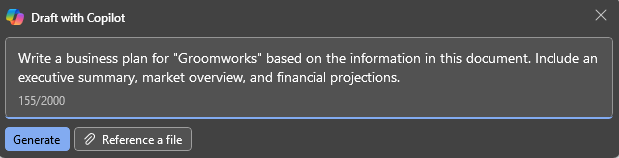
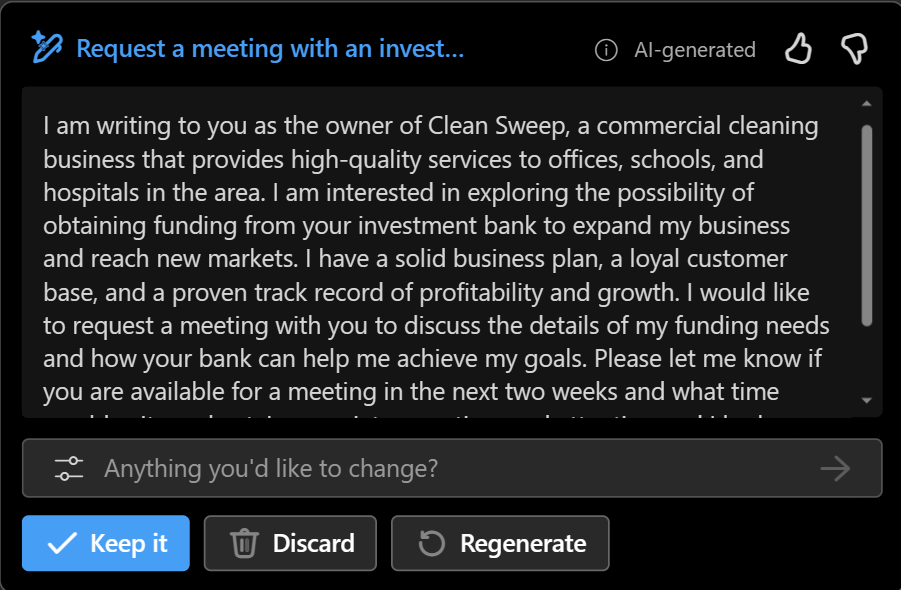
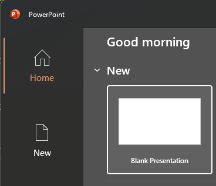
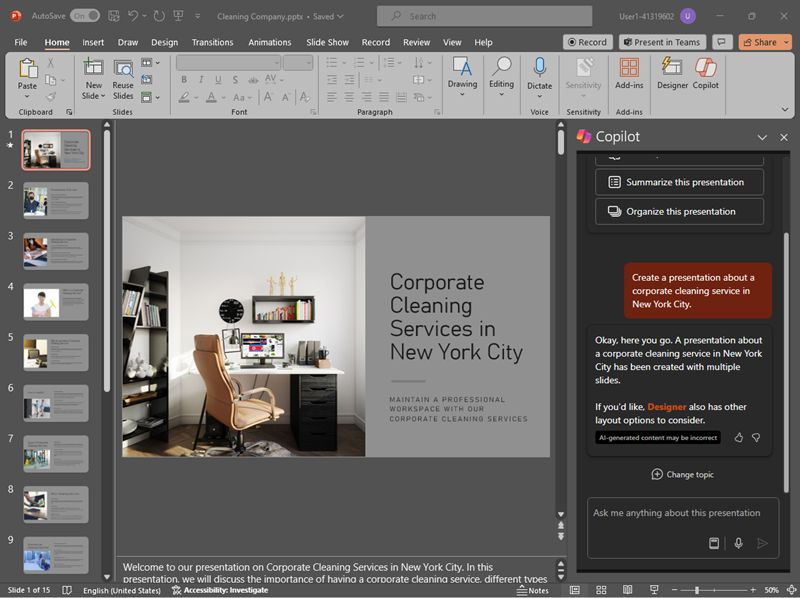

---
lab:
  title: Explorar Copilot para Microsoft 365
---
# Explorar Copilot para Microsoft 365

En este ejercicio explorará algunas de las formas en que Microsoft Copilot puede usar inteligencia artificial generativa para ayudarle a ser más productivo al crear contenido nuevo. En el escenario de este ejercicio, comenzará con algunas notas de alto nivel para una idea empresarial y usará Copilot para Microsoft 365 en varias aplicaciones como Word, PowerPoint y Excel para ayudarle a desarrollar un plan empresarial y una presentación para posibles inversores.

Este ejercicio debería tardar en completarse **40** minutos aproximadamente.

> **Nota**: Este ejercicio requiere una licencia de **Copilot para Microsoft 365** de su organización.

## Uso de Copilot para explorar un documento e investigar una idea

Para iniciar la exploración de la inteligencia artificial generativa, vamos a usar Copilot para Word para examinar un documento existente y extraer información de ella.

1. En el explorador web, abra el documento [Business Idea.docx](https://github.com/MicrosoftLearning/mslearn-ai-fundamentals/raw/main/data/generative-ai/Business%20Idea.docx) en `https://github.com/MicrosoftLearning/mslearn-ai-fundamentals/raw/main/data/generative-ai/Business%20Idea.docx`. 
1. Seleccione **Descargar** para guardar el archivo en la carpeta **Descargas** del equipo.
1. **Mover** o **Copiar y pegar** el documento que acaba de descargar en la carpeta de **OneDrive**.
1. Desde la carpeta de **OneDrive**, abra **Business Idea.docx** en Microsoft Word (cerrando los mensajes de bienvenida o las notificaciones de nuevas características) y revise el documento, que describe algunas ideas de alto nivel para una empresa de limpieza en la ciudad de Nueva York. Si se le solicita, seleccione **Habilitar edición** en la parte superior.
1. Busque y seleccione el icono de **Copilot** en la barra de herramientas de Word para abrir el panel Copilot, como se muestra aquí (el tema visual puede variar):

    

1. En el panel Copilot, escriba después del símbolo del sistema en el área de texto de la parte inferior:

    ```
    What is this document about?
    ```

1. Revise la respuesta de Copilot, que debe resumir los puntos principales del documento, como se muestra aquí:

    

    > La respuesta específica que reciba puede variar debido a la naturaleza de la inteligencia artificial generativa.

1. Vuelva al panel Copilot para formular a Copilot la siguiente pregunta:

    ```
    How do I setup a new business in New York?
    ```

1. Revise la respuesta y realice un seguimiento de las preguntas adicionales según sea necesario. Cuando esté satisfecho con la respuesta, use el icono **Copiar** (&#128461;) en la respuesta para copiarlo en el Portapapeles. Péguelo en el documento de Word, seleccione todo el texto y, a continuación, seleccione el icono de Copilot para visualizar el texto como una tabla.

    

1. Revise la tabla y pida a Copilot que agregue más información, como referencias para obtener más detalles.  La respuesta debe tener un aspecto similar al siguiente (es posible que tenga que usar el botón **Regenerar**):

    

    > **Importante**: La respuesta generada por IA se basa en la información pública en la Web. Aunque puede ser útil ayudarle a comprender los pasos necesarios para configurar un negocio, no se garantiza que sea 100 % preciso y no reemplace la necesidad de asesoramiento profesional.

1. Cuando esté satisfecho con la tabla que ha generado Copilot, seleccione la opción para **Mantenerla**.

## Uso de Copilot para crear contenido para un plan empresarial

Ahora que ha realizado algunas investigaciones iniciales, vamos a que Copilot le ayude a desarrollar un plan de negocio para su empresa de limpieza.

1. Con el documento de **Business Idea.docx** abierto, en el panel Copilot, escriba el siguiente mensaje:

    ```
    Can you suggest a name for my cleaning business?
    ```

1. Revise las sugerencias y seleccione un nombre para su empresa de limpieza (o continúe buscando un nombre que desee).
1. En el documento de Word, seleccione el icono de Copilot en el margen para redactar contenido nuevo. Escriba el siguiente mensaje y reemplace **Contoso Cleaning** por el nombre de la empresa de su elección:

    ```
    Write a business plan for "Contoso Cleaning" based on the information in this document. Include an executive summary, market overview, and financial projections.
    ```

    

1. Revise la respuesta redactada por Copilot y manténgala, ajuste el tono, la longitud o pida a Copilot que vuelva a escribirla con un mensaje nuevo. Aplique los encabezados y estilos adecuados al documento para que sea profesional. Su respuesta debería ser similar a la siguiente:

    

1. Si las proyecciones financieras del plan de negocio no tienen formato de tabla, selecciónela y use Copilot para visualizar las proyecciones como una tabla.
1. Seleccione la tabla de proyecciones financieras y cópiela en el Portapapeles.
1. Guarde el documento de Word.

## Visualización de proyecciones financieras en Copilot para Excel

Con un plan de negocio a mano, vamos a tomar algunos de esos datos sobre proyecciones financieras y pedir a Copilot en Excel que visualicemos esos datos para nosotros, por lo que podemos incluirlos en correos electrónicos o presentaciones a los inversores.

1. En el equipo con aplicaciones de Microsoft 365 instaladas, abra **Excel** y cree un libro en blanco. Guarde inmediatamente el libro como **Financial Projetions.xlsx** en OneDrive o Copilot no funcionará.
1. Pegue la tabla de proyección de ventas de **Business Idea.docx** en la hoja de cálculo de Excel y **formatearla como una tabla**. Para ello, siga estos pasos:
    1. Seleccione una **celda** dentro de los datos.
    1. Seleccione **Inicio** y elija **Formato como tabla** en Estilos. 
    1. Elija un estilo para la tabla.
    1. En el cuadro de diálogo **Crear tabla**, confirme o establezca el intervalo de celdas.
    1. Marque si la tabla tiene encabezados y seleccione **Aceptar**.
1. Con las proyecciones de ventas con formato de tabla, abra el panel Copilot desde la cinta de Excel y escriba el símbolo del sistema siguiente:

    ```
    Suggest ways to visualize these financial projections.
    ```
    
1. Copilot debe sugerir 1 o 2 maneras de visualizar los datos y ofrecer para agregar un gráfico dinámico a una nueva hoja.

    

1. Sin embargo, puede que desee ver más datos en el gráfico para mostrar los cambios de año a año, por lo que escriba el siguiente símbolo del sistema para agregar más:

    ```
    Visualize these financial projections in a line chart to show year-over-year revenue and profits.
    ```

    

1. Agregue el gráfico dinámico a una nueva hoja y ábralo. Seleccione el gráfico y, a continuación, seleccione **Diseño** para aplicar estilos, cambiar el tipo de gráfico y otras acciones. Al final, debería tener algo similar al siguiente:

    

1. Guarde el archivo en OneDrive y cierre Excel.

Acaba de usar los datos creados a partir de Copilot en Word para visualizarlos en Excel. En el ejercicio siguiente, pasaremos al uso de Copilot en Outlook para redactar y enviar correos electrónicos sobre el trabajo que ha realizado.

## Uso de Copilot para redactar un correo electrónico

Ha creado algunas garantías para ayudarle a empezar a trabajar con su negocio. Ahora es el momento de ponerse en contacto con un inversor que busca alguna financiación de inicio.

1. En el equipo con aplicaciones de Microsoft 365 instaladas, abra **Outlook**. Si no ha configurado Outlook con su cuenta de Microsoft 365, vea [Configurar y usar Outlook: Soporte técnico de Microsoft](https://support.microsoft.com/office/set-up-and-use-outlook-4636f361-d5e3-4a87-9cd4-382858de55fa).
1. Active la experiencia **nueva Outlook**. Para obtener las últimas características de Copilot en Outlook, debe usar la experiencia "Nueva Outlook". Para ver qué versión está usando, vea [¿Qué versión de Outlook tengo? - Soporte técnico de Microsoft](https://support.microsoft.com/office/what-version-of-outlook-do-i-have-b3a9568c-edb5-42b9-9825-d48d82b2257c).
1. Cree un nuevo correo electrónico y rellene el cuadro **Para** con su propia dirección de correo electrónico.
1. Puede empezar a redactar el correo electrónico desde el panel Copilot o directamente desde el cuerpo del correo electrónico:

    
    
1. Escriba el siguiente símbolo del sistema y ajuste el tono a "Formal" y la longitud a "Mediana":

    ```
    Request a meeting with an investment bank to discuss funding for a commercial cleaning business.
    ```

    

1. Seleccione **Generar borrador**y revise la salida generada. Ajuste el tono o indique a Copilot lo que le gustaría cambiar sobre el correo electrónico.

    

1. Puede enviar el correo electrónico a sí mismo si lo desea.

## Uso de Copilot para crear contenido para una presentación

Con la ayuda de Copilot, ha creado un borrador de un plan de negocio para la idea empresarial de limpieza, preparó algunas proyecciones financieras y envió un correo electrónico para solicitar una reunión con un inversor potencial. Ahora necesitará una presentación eficaz para comunicar las ventajas de su negocio.

1. Abra **PowerPoint** y cree una nueva **presentación en blanco**. Si el panel**Diseñador** se abre automáticamente, ciérrelo.

    

1. Guarde la presentación como **Limpieza Company.pptx** en la carpeta de OneDrive.
1. Seleccione el **botón Copilot** en la pestaña **Inicio de la cinta** de opciones, seleccione **Crear presentación sobre...** y, a continuación, complete el mensaje en el panel Copilot de la siguiente manera:

    ```
    Create a presentation about a corporate cleaning service in New York City.
    ```

1. Copilot generará diapositivas en la presentación.  El proceso puede tardar varios minutos y la salida debe tener un aspecto similar al siguiente con un tema diferente:

    

1. Seleccione la segunda diapositiva de la presentación. A continuación, en el panel Copilot, pida que agregue una nueva diapositiva con este símbolo del sistema:

    ```
    Add a slide that describes the benefits of an eco-friendly approach to cleaning. 
    ```

    

1. Guarde la presentación.

## Desafío

Ahora ha visto cómo usar Copilot para Microsoft 365 en un par de aplicaciones diferentes para investigar ideas y generar contenido, ¿por qué no intentar explorar aún más? Intente usar Copilot para planear un evento para promover la alfabetización infantil en una biblioteca local. Algunas cosas que podría probar incluyen:

- Investigue algunas sugerencias para animar a los niños a leer a una edad temprana.
- Cree un folleto o póster para el evento.
- Redacte un correo electrónico para una campaña para invitar a los autores de niños locales a venir y hablar en el evento.
- Cree una presentación para iniciar el evento.

Sea tan inventiva como le guste y explore cómo Copilot puede ayudarle a encontrar información, generar y refinar texto, crear imágenes y responder preguntas.

## Conclusión

En este ejercicio, ha usado [Copilot para Microsoft 365](https://www.microsoft.com/microsoft-365/enterprise/copilot-for-microsoft-365) para buscar información y generar contenido. Esperamos que haya visto cómo usar inteligencia artificial generativa en un copiloto puede ayudar con la productividad y la creatividad. Microsoft 365 le permite aportar la eficacia de la inteligencia artificial generativa a los datos y procesos empresariales, al tiempo que se integra en la infraestructura de TI existente para garantizar una solución fácil de administrar y proteger.
