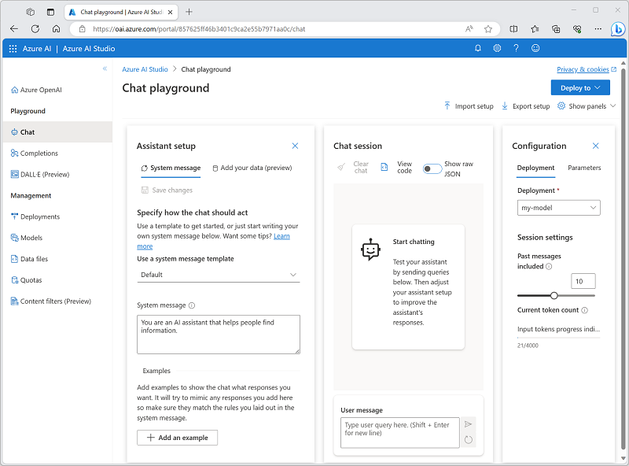

---
lab:
  title: Exploración de Azure OpenAI Service
---

# Exploración de Azure OpenAI

Azure OpenAI Service proporciona los modelos de inteligencia artificial generativa desarrollados por OpenAI para la plataforma Azure, lo que permite desarrollar eficaces soluciones de inteligencia artificial que se benefician de seguridad, escalabilidad e integración de los servicios que proporciona la plataforma en la nube Azure.

En este ejercicio, explorará Azure OpenAI Service y lo usará para implementar y experimentar con modelos de IA generativa.

Este ejercicio dura aproximadamente **25** minutos.

## Antes de comenzar

Necesitará una suscripción de Azure que se haya aprobado para acceder al servicio Azure OpenAI tanto para modelos de texto como de código, y modelos de generación de imágenes DALL-E.

- Para registrarse para obtener una suscripción gratuita de Azure, vaya a [https://azure.microsoft.com/free](https://azure.microsoft.com/free).
- Para solicitar acceso a Azure OpenAI Service, vaya a [https://aka.ms/oaiapply](https://aka.ms/oaiapply).

## Aprovisionamiento de un recurso de Azure OpenAI

Para poder usar modelos de Azure OpenAI, debe aprovisionar un recurso de Azure OpenAI en su suscripción de Azure.

1. Inicie sesión en [Azure Portal](https://portal.azure.com).
2. Cree un recurso de **Azure OpenAI** con la siguiente configuración:
    - **Suscripción**: *Una suscripción de Azure aprobada para acceder al servicio Azure OpenAI.*
    - **Grupo de recursos**: *Elija un grupo de recursos existente o cree uno nuevo con un nombre de su elección.*
    - **Región**: Este de EE. UU.\*
    - **Nombre**: *nombre único que prefiera*
    - **Plan de tarifa**: estándar S0

    > \* Las distintas regiones tienen una disponibilidad y cuota diferentes para los modelos. En este ejercicio, usará un modelo GPT-35-Turbo para la generación de texto y un modelo DALL-E para la generación de imágenes, ambos son admitidos en el este de EE. UU.

3. Espere a que la implementación finalice. A continuación, vaya al recurso de Azure OpenAI implementado en Azure Portal.

## Exploración de Azure OpenAI Studio

Puede implementar, administrar y explorar modelos en Azure OpenAI Service mediante Azure OpenAI Studio.

1. En la página **Información general** del recurso de Azure OpenAI, use el botón **Explorar** para abrir Azure OpenAI Studio en una nueva pestaña del explorador. También puede ir directamente a [Azure OpenAI Studio](https://oai.azure.com/).

    La primera vez que abra Azure OpenAI Studio, debería tener un aspecto similar al siguiente:

    

1. Vea las páginas disponibles en el panel de la izquierda. Siempre puede volver a la página principal en la parte superior. Además, OpenAI Studio proporciona varias páginas donde puede:
    - Experimentar con modelos en un *área de juegos*.
    - Crear y administrar implementaciones de modelo y datos.

## Implementación de un modelo para la generación de lenguajes

Para experimentar con la generación de lenguaje natural, primero debe implementar un modelo.

1. Vea en la página **Modelos** los modelos disponibles en la instancia del servicio Azure OpenAI.
1. Seleccione cualquiera de los modelos **gpt-35-turbo** para los que el estado **Implementable** es **Sí** y, a continuación, seleccione **Implementar**:

    

1. Cree una nueva implementación con la siguiente configuración:
    - **Modelo**: gpt-35-turbo
    - **Versión de Modev**: actualización automática al valor predeterminado.
    - **Nombre de implementación**: *Un nombre único para la implementación de modelo*
    - **Opciones avanzadas**
        - **Filtro de contenido**: valor predeterminado
        - **Tipo de implementación**: Estándar
        - **Límite de velocidad de tokens por minuto**: 5000\*
        - **Habilitación de la cuota dinámica**: habilitado

    > \* Un límite de velocidad de 5000 tokens por minuto es más que adecuado para completar este ejercicio, al tiempo que deja capacidad para otras personas que usan la misma suscripción.

## Uso del área de juegos de *Chat* para trabajar con el modelo

Ahora que ha implementado un modelo, puede usarlo en el área de juegos de *Chat* para generar la salida del lenguaje natural a partir de mensajes que envíe en una interfaz de chat.

1. En [Azure OpenAI Studio](https://oai.azure.com/), vaya al área de juegos de **chat** del panel izquierdo.

    El área de juegos de *Chat* proporciona una interfaz de bot de chat con la que puede interactuar con el modelo implementado, como se muestra aquí:

    

1. En el panel **Configuración**, asegúrese de que la implementación de modelo esté seleccionada.
1. En el panel **Asistente de configuración**, seleccione la plantilla de mensaje del sistema **predeterminada** y vea el mensaje del sistema que crea esta plantilla. El mensaje del sistema define cómo se comportará el modelo en la sesión de chat.
1. En la sección **Sesión de chat**, escriba el siguiente mensaje de usuario.

    ```
   What is generative AI?
    ```

1. Observe la salida devuelta por el modelo, que debe proporcionar una definición de IA generativa.
1. Escriba el siguiente mensaje de usuario como una pregunta de seguimiento:

    ```
   What are three benefits it provides?
    ```

1. Revise la salida, teniendo en cuenta que la sesión de chat ha realizado un seguimiento de la entrada y la respuesta anteriores para proporcionar contexto (por lo que interpreta correctamente que "eso" se refiere a "IA generativa") y que proporciona una respuesta adecuada basada en lo que se solicitó (debería devolver tres ventajas de la inteligencia artificial generativa).

## Uso del área de juegos de *DALL-E* para generar imágenes

Además de los modelos de generación de lenguaje, Azure OpenAI Service admite el modelo DALL-E 2 para la generación de imágenes.

> **Nota**: Debe haber solicitado y recibido acceso a la funcionalidad DALL-E en la solicitud de acceso al servicio Azure OpenAI para completar esta sección del ejercicio.

1. En [Azure OpenAI Studio](https://oai.azure.com/), vaya al área de juegos de **Chat** del panel izquierdo.
1. Escriba lo siguiente:

    ```
    A robot eating spaghetti
    ```

1. Seleccione **Generar** y vea los resultados, que deben constar de una imagen en función de la descripción que proporcionó en el símbolo del sistema, de forma similar a la siguiente:

    

1. Genere una segunda imagen modificando la solicitud para:

    ```
    A robot eating spaghetti in the style of Rembrandt
    ```
1. Compruebe que la nueva imagen coincide con los requisitos del símbolo del sistema, de forma similar a esta:

    

## Limpiar

Cuando haya terminado de usar el recurso de Azure OpenAI, recuerde eliminar la implementación o el recurso entero en [Azure Portal](https://portal.azure.com/?azure-portal=true).
